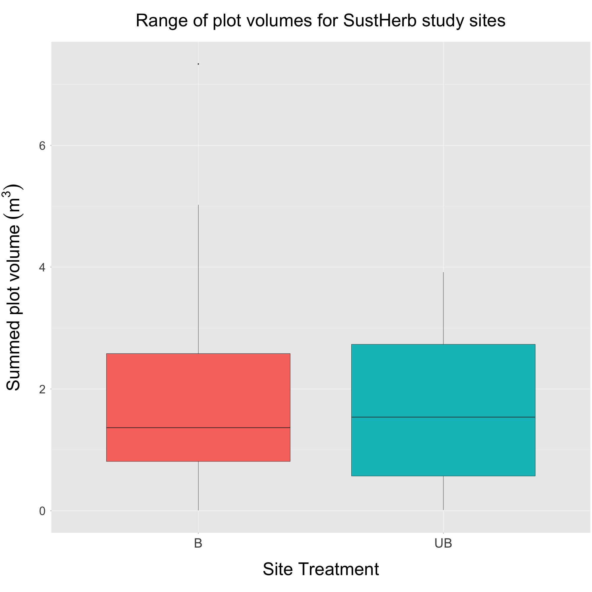
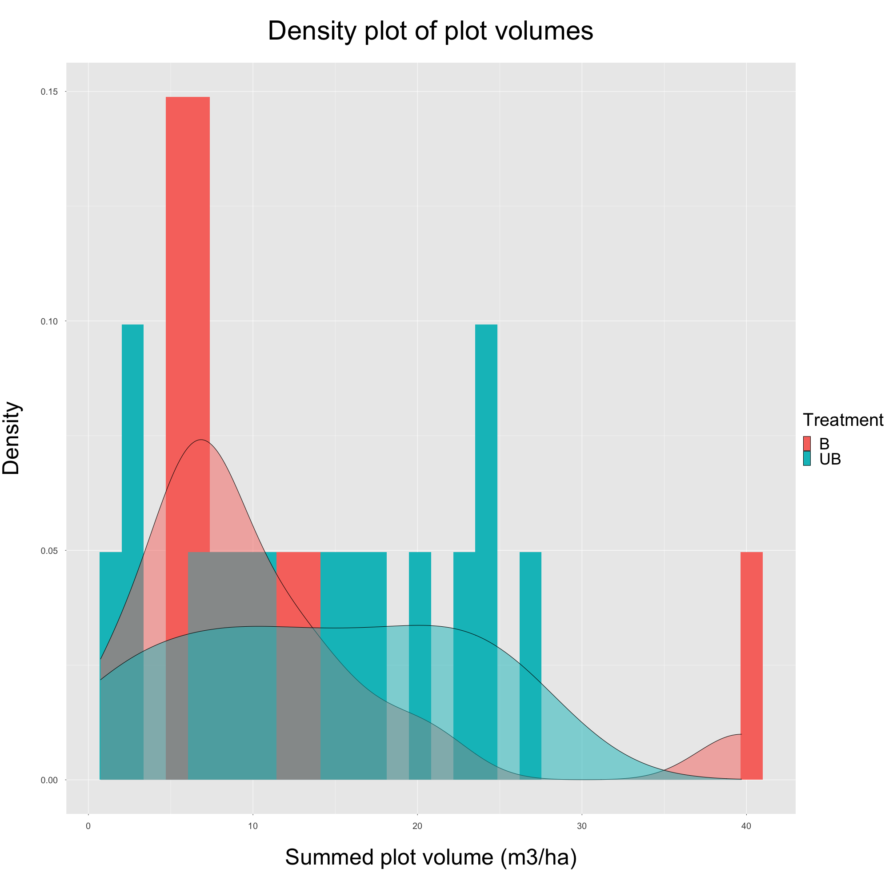
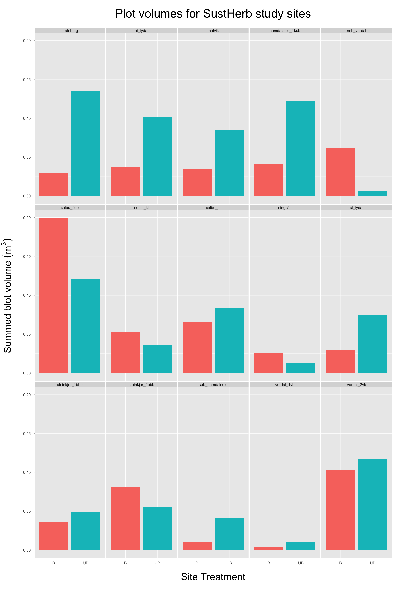

---
output:
  html_document: default
  word_document: default
  pdf_document: default
---
# Plot Tree Volumes - Approach 1
## ("Allometric" Approach)

**Summary:**
This document contains plots produced through 'Approach 1', specifically in regards to the total tree volume for each SustHerb study site plot. More specifically, it contains: 

* *Figure 1*. Boxplot showing the range of total plot volumes for SustHerb study sites, grouped by treatment.
* *Figure 2*. Density plot showing distributions of plot volumes, grouped by treatment.
* *Figure 3*. Barplot showing total plot volumes for SustHerb study sites, faceted by site and grouped by treatment.

**NOTE**: This approach only contains sites from the Trøndelag region (n = 15)

***

**Figure 1:**
This figure shows the range of total plot volumes for SustHerb study sites, grouped by treatment. Using Approach 3, it appears that exclosures are estimated to have a higher total volume than open plots.
  
  
```{r pressure, echo=FALSE, out.width = '70%', fig.align="center"}

```


***
\pagebreak

**Figure 2:**
This figure shows distributions of volumes grouped by treatment.
  
```{r echo=FALSE, out.width = '85%', fig.align="center"}

```

***

\pagebreak

**Figure 3:**
This figure shows plot volumes for each SustHerb study site, grouped by treatment.
  
```{r echo=FALSE, out.width = '85%', fig.align="center"}

```

***
