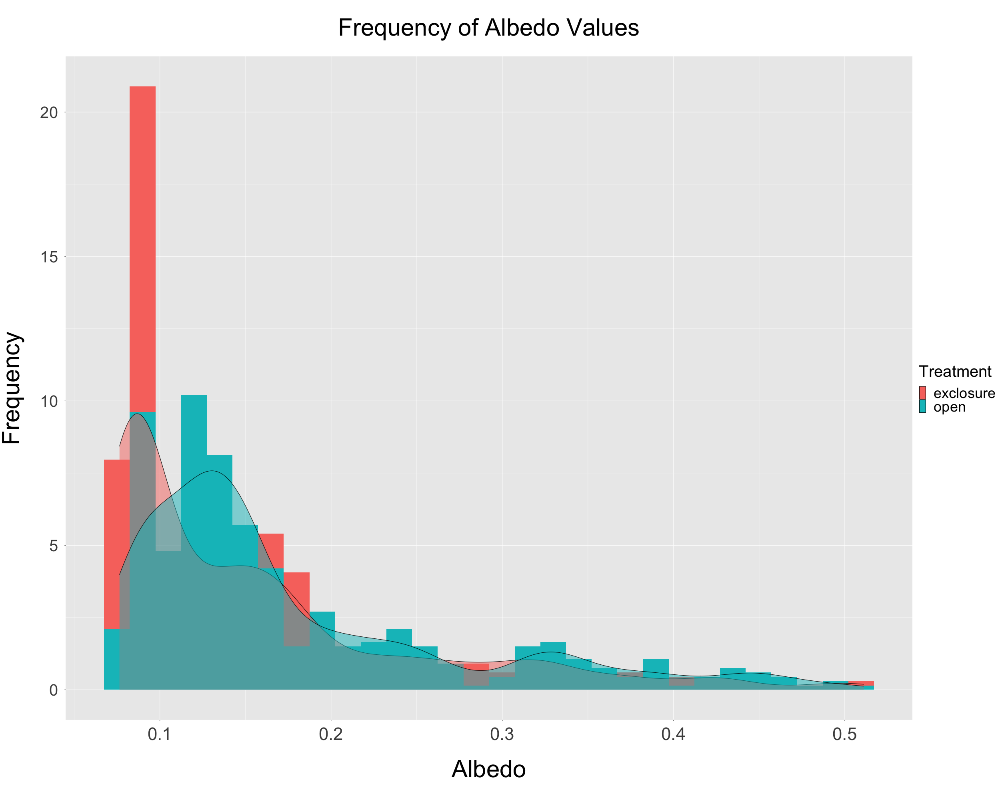
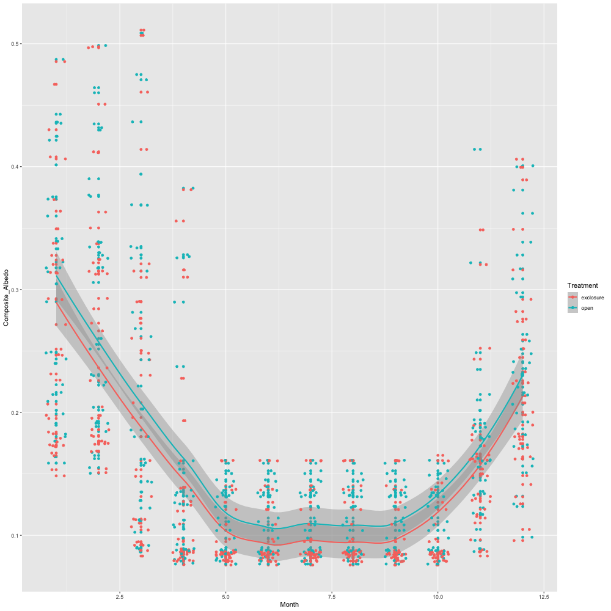
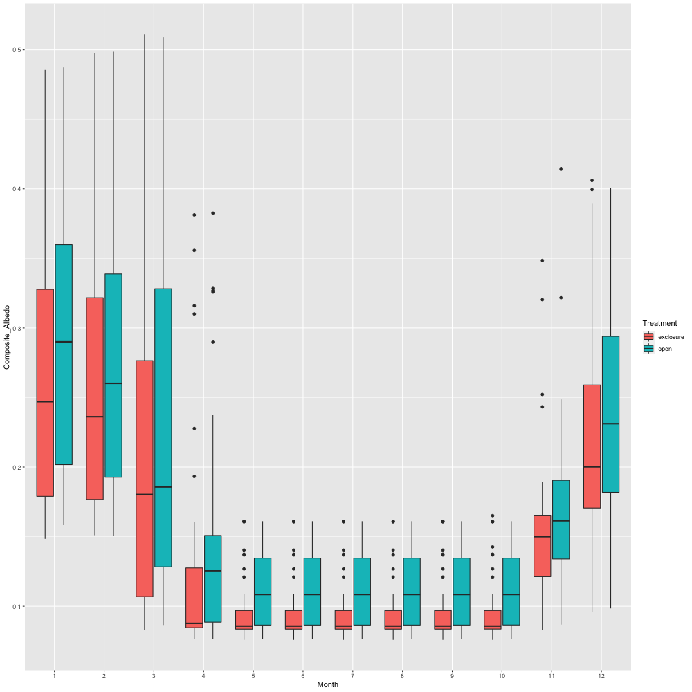
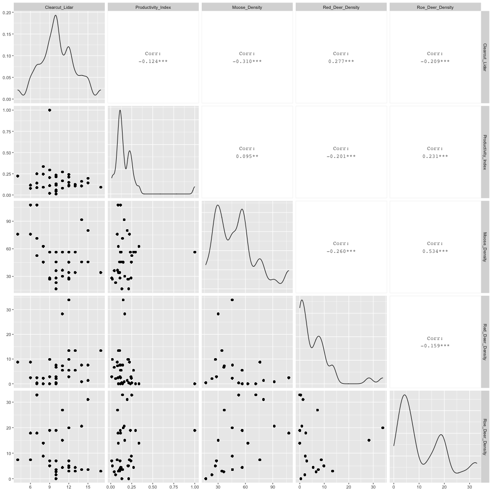
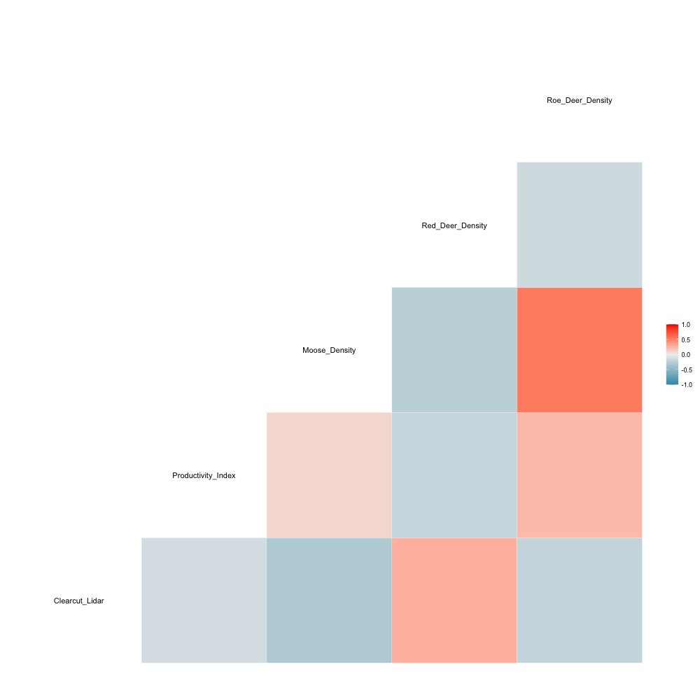
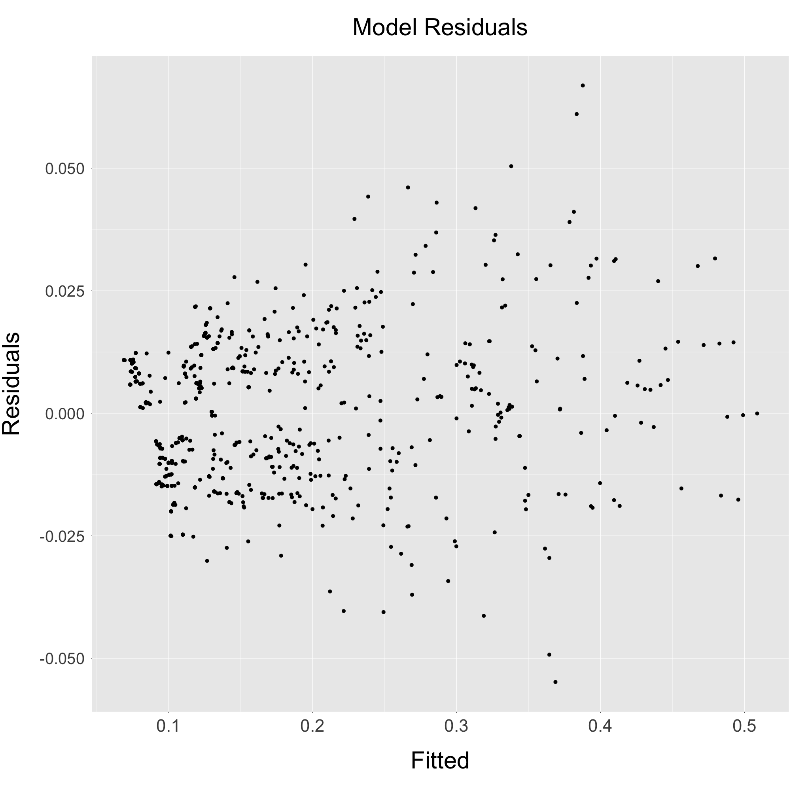
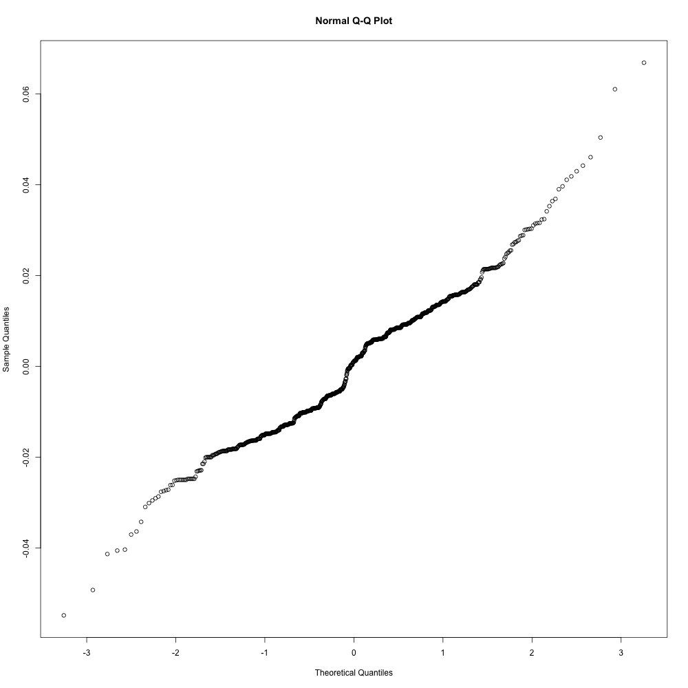
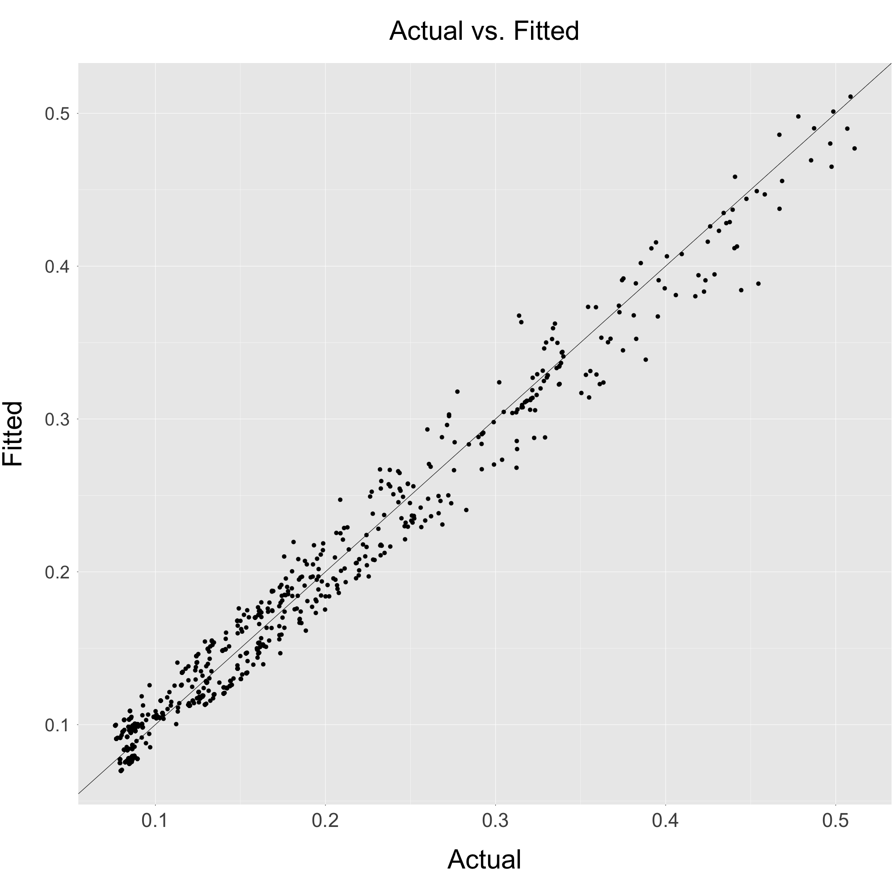

---
output:
  html_document: default
  word_document: default
  pdf_document: default
---

# Albedo Estimates - Approach 2
## ("LiDAR Hull" Approach)

**Summary:**
This document contains a summary of albedo estimates produced through 'Approach 2', including the figures listed below:

* *Section 1*. Plots relevant to final albedo estimates.
* *Section 2*. Mixed effects model + output.
* *Section 3*. Relevant data + albedo estimates for each site.

  
***

## Section 1
This figure shows several plots related to the final albedo estimates produced by Approach 2. 
  
```{r pressure, echo=FALSE, out.width = '80%', fig.align="center"}

knitr::include_graphics("../../../Approach_2/Output/Albedo_Estimates/albedo_boxplot_approach_2.png")


```

```{r, echo=FALSE, out.width = '100%', fig.align="center"}




```

***

\pagebreak

## Section 2
This figure shows an initial attempt at a mixed effects model analysis.

**Correlation matrix of explanatory variables**:
It looks like 'Moose Density' and 'Roe Deer Density' are moderately correlated (~0.51).

```{r, echo=FALSE, out.width = '80%', fig.align="center"}




```

***

**Model in R**: 
Random effect is month nested under site ("LocalityName")

```{r, echo=TRUE, eval=FALSE}
model <- lmer(Composite_Albedo ~ Treatment +
                      Productivity_Index +
                      Canopy_Height_MAD +
                      Clearcut_Lidar +
                      Moose_Density +
                      Red_Deer_Density +
                      Roe_Deer_Density +
                      (1 | LocalityName/Month),
              data = model_data)
```

***

**Model Output**:

```{r, eval = TRUE, echo=FALSE, message=FALSE, out.width = '80%', fig.align="center"}

library(lme4)
library(lmerTest)
library(sjPlot)

#Get CSV of albedo estimates
model_data <- read.csv('../../../Approach_2/Output/Albedo_Estimates/albedo_estimates_approach_2.csv', header = TRUE)
                
#Format columns
model_data$Month <- as.factor(model_data$Month)
model_data$LocalityCode <- as.factor(model_data$LocalityCode)
model_data$LocalityName <- as.factor(model_data$LocalityName)
                
model <- lmer(Composite_Albedo ~ Treatment + Productivity_Index + Clearcut_Lidar + Moose_Density + Red_Deer_Density + Roe_Deer_Density + (1 | LocalityName/Month), data = model_data)

tab_model(model, digits = 5, file = "../../../Approach_2/Output/Analysis/model_approach_2.html")

```

***

**Exploring Model Fit**:

```{r, echo=FALSE, out.width = '80%', fig.align="center"}



knitr::include_graphics("../../../Approach_2/Output/Analysis/residuals_hist_approach_2.png")



```


***

## Section 3
This section shows relevant data and albedo estimates for each SustHerb site.

```{r, echo=FALSE, message = FALSE, out.width = '80%', fig.align="center"}

library(ggplot2)

#Load main site data
sites <- read.csv(file = '../../../Data/SustHerb_Site_Data/cleaned_data/cleaned_data.csv', header = T)

#Load albedo estimates
albedo <- read.csv(file = '../../../Approach_2/Output/Albedo_Estimates/albedo_estimates_approach_2.csv', header = T)

#Load volumes
volumes <- read.csv(file = '../../../Approach_2/Output/Tree_Volumes/total_plot_volumes_approach_2.csv', header = T)

        #For each site, produce relevant plots + graphics

                #Ensure that LocalityName is factor
                albedo$LocalityName <- as.factor(albedo$LocalityName)
                
#Load SWE data
swe <- read.csv(file = '../../../Universal/Output/SWE/monthly_avg_swe_mm.csv', header = T)  

#Load temp data
temps <- read.csv(file = '../../../Universal/Output/Temperature/monthly_avg_temp_C.csv', header = T)

#Load tree species proportion data
trees <- read.csv(file = '../../../Universal/Output/Tree_Species_Proportions/tree_species_proportions_plot_level.csv', header = T)
                
```


```{r fig.align="center", echo = FALSE, eval = TRUE, out.width="50%"}
                #Loop through levels of LocalityName
                sites$LocalityName <- as.factor(sites$LocalityName)

                for(i in levels(sites$LocalityName)){
                     
                        
                        #Get relevant subsets of data
                        
                                #Site name
                                site <- i
                                
                                #Browsed site code
                                b <- as.character(sites$LocalityCode[sites$LocalityName == i & sites$Treatment == "open"])
                                
                                #Unbrowsed site code
                                ub <- as.character(sites$LocalityCode[sites$LocalityName == i & sites$Treatment == "exclosure"])
                        
                                #Albedo for this site
                                locality <- albedo[albedo$LocalityName == site,]
                                
                                #Volume
                                vol <- volumes[volumes$Site_name == site,]
        
                                
                                #seNorge data (SWE + Temp) (using 'browsed plot')
                                        
                                        #SWE
                                        swe_sub <- swe[swe$LocalityCode == b,]
                                                
                                        #Temp
                                        temp_sub <- temps[temps$LocalityCode == b,]
                                        
                                                #Convert to Kelvin
                                                for(j in 1:12){
                                                        temp_sub[j, "Avg_Temp_C"] <- temp_sub[j, "Avg_Temp_C"] + 273.15
                                                }
                                        
                                #Tree Species Proportion Data
                                        
                                        #Browsed
                                        
                                                #Get LiDAR year for browsed plot
                                                lidar_year_b <- sites$LiDAR.data.from.year[sites$LocalityCode == b]
                                                
                                                #Get tree species proportions from LiDAR year
                                                spruce_prop_b <- data.frame("prop" = trees$Prop_spruce[trees$LocalityCode == b & trees$Year == lidar_year_b], "Species" = "Spruce")
                                                pine_prop_b <- data.frame("prop" = trees$Prop_pine[trees$LocalityCode == b & trees$Year == lidar_year_b], "Species" = "Pine")
                                                birch_prop_b <- data.frame("prop" = trees$Prop_birch[trees$LocalityCode == b & trees$Year == lidar_year_b], "Species" = "Birch/Deciduous")
                                                
                                                #Bind to temp df
                                                props_b <- rbind(spruce_prop_b, pine_prop_b, birch_prop_b)
                                                
                                        #Unbrowsed
                                        
                                                #Get LiDAR year for browsed plot
                                                lidar_year_ub <- sites$LiDAR.data.from.year[sites$LocalityCode == ub]
                                                
                                                #Get tree species proportions from LiDAR year
                                                spruce_prop_ub <- data.frame("prop" = trees$Prop_spruce[trees$LocalityCode == ub & trees$Year == lidar_year_ub], "Species" = "Spruce")
                                                pine_prop_ub <- data.frame("prop" = trees$Prop_pine[trees$LocalityCode == ub & trees$Year == lidar_year_ub], "Species" = "Pine")
                                                birch_prop_ub <- data.frame("prop" = trees$Prop_birch[trees$LocalityCode == ub & trees$Year == lidar_year_ub], "Species" = "Birch/Deciduous")
                                                
                                                #Bind to temp df
                                                props_ub <- rbind(spruce_prop_ub, pine_prop_ub, birch_prop_ub)

                        #Echo name of site
                        name <- as.character(locality$LocalityName[[1]])
                        
                        #Pie chart of species proportions (browsed)
                        pie_chart_b <- ggplot(props_b, aes(x = 2, y = prop, fill = Species)) +
                                          geom_bar(stat = "identity", color = "white") +
                                          ggtitle("Tree Species (Browsed)") +
                                          coord_polar(theta = "y", start = 0) +
                                          theme_void() +
                                          xlim(0.5, 2.5)
                           
                        
                        #Pie chart of species proportions (unbrowsed)
                        pie_chart_ub <- ggplot(props_ub, aes(x = 2, y = prop, fill = Species)) +
                                          geom_bar(stat = "identity", color = "white") +
                                        ggtitle("Tree Species (Exclosure)") +
                                          coord_polar(theta = "y", start = 0)+
                                          theme_void()+
                                          xlim(0.5, 2.5)

                        #Volume boxplot, grouped by treatment
                        plot1 <- ggplot(data = vol, aes(x = Treatment, y = Summed_crown_volume, fill = Treatment)) +
                                        geom_bar(stat="identity") +
                                        ggtitle("Plot Volumes") +
                                        labs(x = "Site Treatment", y = bquote("Plot volume"~(m^3))) +
                                        theme(plot.title = element_text(hjust = 0.5, size = 12, margin = margin(t = 10, b = 10)),
                                              legend.position = "none",
                                              axis.text.x = element_text(size = 10, margin = margin(t=8)),
                                              axis.text.y = element_text(size = 10, margin = margin(r=8)),
                                              axis.title.x = element_text(size = 12, margin = margin(t=10, b = 10)),
                                              axis.title.y = element_text(size = 12, margin = margin(r=10)))
                        

                        #Snow Water Equivalent time series for location
                        plot2 <- ggplot(data = swe_sub, aes(x = Month,
                                                            y = SWE_mm)) +
                                        geom_line() +
                                        geom_point() +
                                        ggtitle("Monthly Avg SWE (mm)") +
                                        labs(x = "Month", y = "Avg. SWE (mm)") +
                                        scale_x_discrete(limits=c(1:12)) +
                                        theme(plot.title = element_text(hjust = 0.5,
                                                                        size = 12,
                                                                        margin = margin(t = 10, b = 10)),
                                              legend.title = element_text(size = 10),
                                              legend.text = element_text(size = 8),
                                              axis.text.x = element_text(size = 10, margin = margin(t=8)),
                                              axis.text.y = element_text(size = 10, margin = margin(r=8)),
                                              axis.title.x = element_text(size = 12, margin = margin(t=10, b = 10)),
                                              axis.title.y = element_text(size = 12, margin = margin(r=10)))
                                

                        #Temp time series for location
                        plot3 <- ggplot(data = temp_sub, aes(x = Month,
                                                            y = Avg_Temp_C)) +
                                geom_line() +
                                geom_point() +
                                ggtitle("Monthly Avg Temperature (K)") +
                                labs(x = "Month", y = "Avg. Temperature (K)") +
                                scale_x_discrete(limits=c(1:12)) +
                                theme(plot.title = element_text(hjust = 0.5,
                                                                size = 12,
                                                                margin = margin(t = 10, b = 10)),
                                      legend.title = element_text(size = 10),
                                      legend.text = element_text(size = 8),
                                      axis.text.x = element_text(size = 10, margin = margin(t=8)),
                                      axis.text.y = element_text(size = 10, margin = margin(r=8)),
                                      axis.title.x = element_text(size = 12, margin = margin(t=10, b = 10)),
                                      axis.title.y = element_text(size = 12, margin = margin(r=10)))
                                

                        #Time series albedo plot, grouped by treatment
                        plot4 <- ggplot(data = locality, aes(x = Month,
                                                            y = Composite_Albedo,
                                                            color = Treatment,
                                                            group = Treatment)) +
                                geom_point() +
                                stat_summary(fun=mean,geom="line",lwd=0.8,aes(group=Treatment)) +
                                ggtitle("Monthly Albedo Estimates") +
                                labs(x = "Month", y = "Albedo") +
                                scale_x_discrete(limits=c(1:12)) +
                                theme(plot.title = element_text(hjust = 0.5,
                                                                size = 12,
                                                                margin = margin(t = 10, b = 10)),
                                      legend.title = element_text(size = 10),
                                      legend.text = element_text(size = 8),
                                      axis.text.x = element_text(size = 10, margin = margin(t=8)),
                                      axis.text.y = element_text(size = 10, margin = margin(r=8)),
                                      axis.title.x = element_text(size = 12, margin = margin(t=10, b = 10)),
                                      axis.title.y = element_text(size = 12, margin = margin(r=10)))
                                
                        #Print site name
                        cat("Site: ", name)
                        cat("\n")
                        print(pie_chart_b)
                        print(pie_chart_ub)
                        print(plot1)
                        print(plot2)
                        print(plot3)
                        print(plot4)
                        


                }

```
