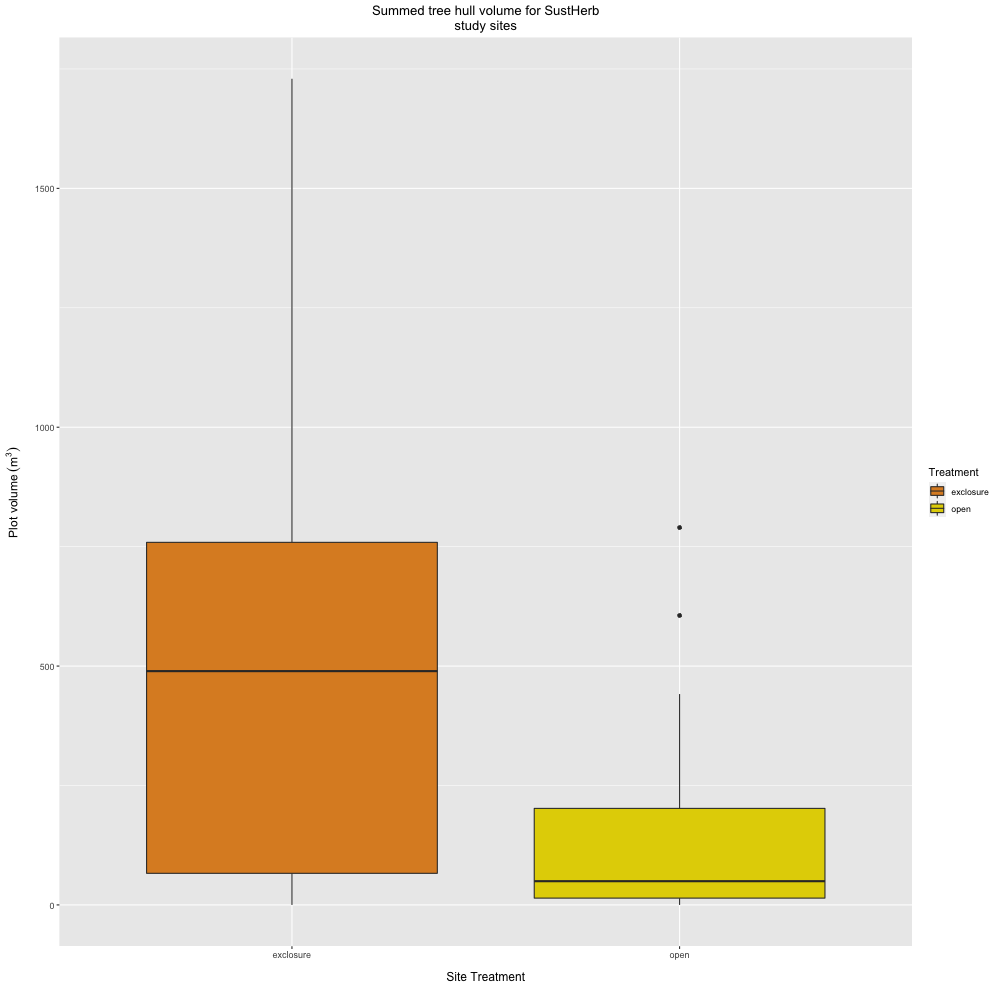
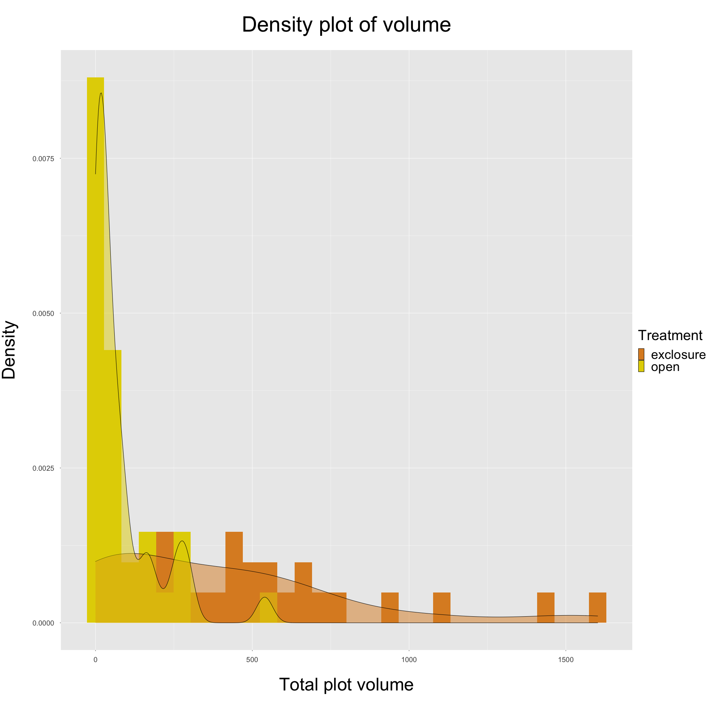
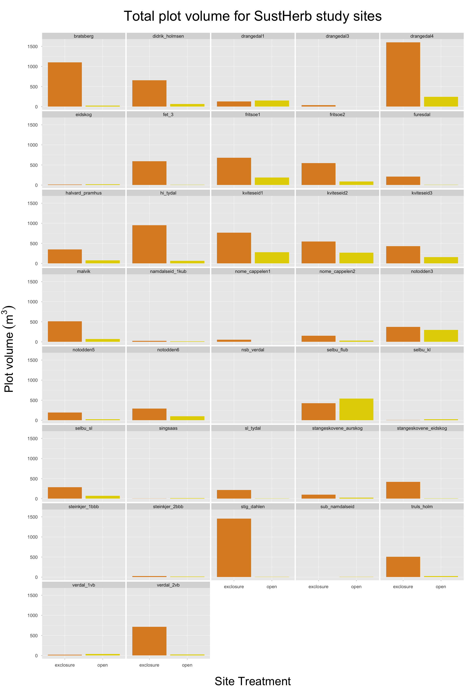

---
output:
  html_document: default
  word_document: default
  pdf_document: default
---
# Plot Tree Volumes - Approach 2
## ("LiDAR Hull" Approach)

**Summary:**
This document contains plots produced through 'Approach 2', specifically in regards to the total tree volume for each SustHerb study site plot. More specifically, it contains:

* *Figure 1*. Boxplot showing the range of total plot volumes for SustHerb study sites, grouped by treatment.
* *Figure 2*. Density plot showing distributions of plot volumes, grouped by treatment.
* *Figure 3*. Barplot showing total plot volumes for SustHerb study sites, faceted by site and grouped by treatment.
* *Figure 4*. Base area of tree hulls (produced from canopy height models) for each plot, clipped to 20x20m with trees >7m in height and all LiDAR points below 1m (which aren't associated with a tree) removed.  
  
***

**Figure 1:**
This figure shows the range of total plot volumes for SustHerb study sites, grouped by treatment. 
  
  
```{r pressure, echo=FALSE, out.width = '70%', fig.align="center"}

```


***
\pagebreak

**Figure 2:**
This figure shows distributions of volumes grouped by treatment.
  
```{r echo=FALSE, out.width = '85%', fig.align="center"}

```

***

\pagebreak

**Figure 3:**
This figure shows plot volumes for each SustHerb study site, grouped by treatment.
  
```{r echo=FALSE, out.width = '85%', fig.align="center"}

```
\pagebreak

***

**Figure 4:**
This figure shows both the final tree hulls used to calculate total volume for each plot. They are produced after topographical normalization of the original LAS file, tree segmentation (via watershed algorithm; height threshold of 1m), removal of LiDAR points associated with trees >7m, removal of LiDAR points not associated with segmented trees >1m (including all ground points), and clipping to 20x20m.

To generate the CHMs, I used a slightly different approach than Ingrid Snøan did in her project - she used the 'p2r' digital surface model algorithm, while I used the 'pitfree' algorithm and a few other parameters that were recommended by Khosravipour et al. (2014) to minimize the number of pits in the CHM while maximizing resolution. I tested various pixel resolutions for the CHM models, and found that a resolution of 0.5m seemed to produce the most detailed CHM with the fewest pits.


```{r echo=FALSE, fig.show = "hold", out.width = '40%', fig.align="center"}

files <- list.files(path = '../../../Approach_2/Output/Tree_Volumes/Hulls/',
                    full.names = TRUE)

knitr::include_graphics(files)

```
