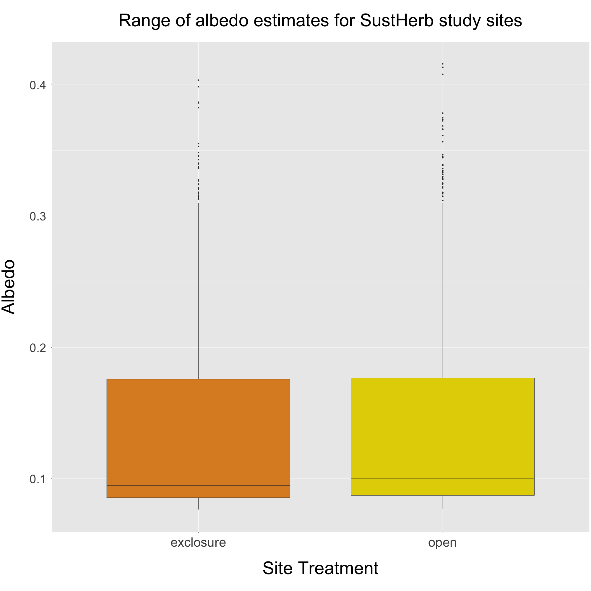
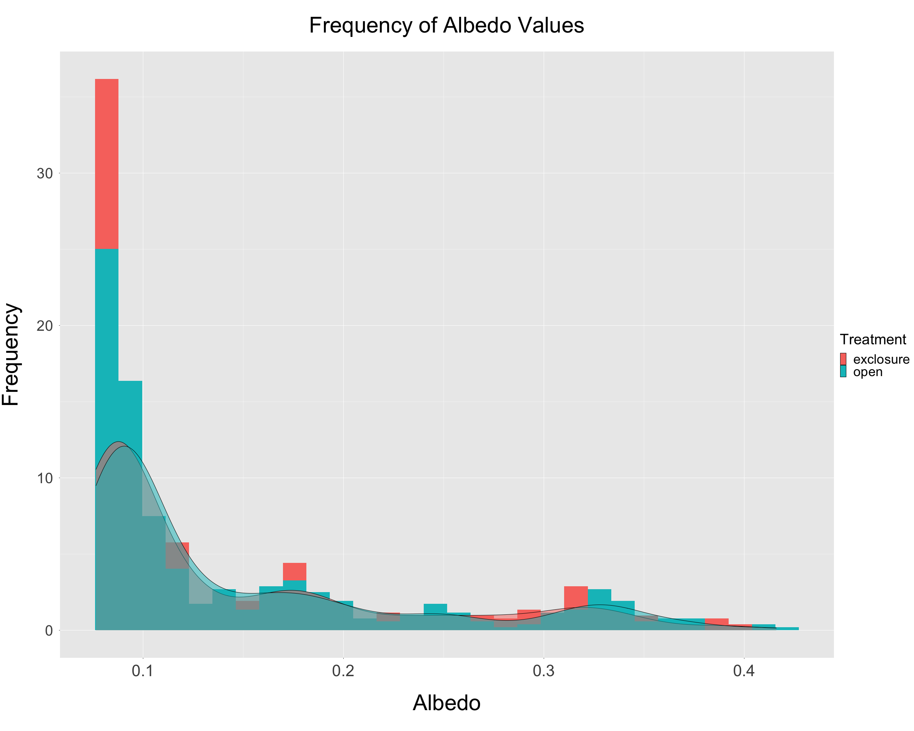
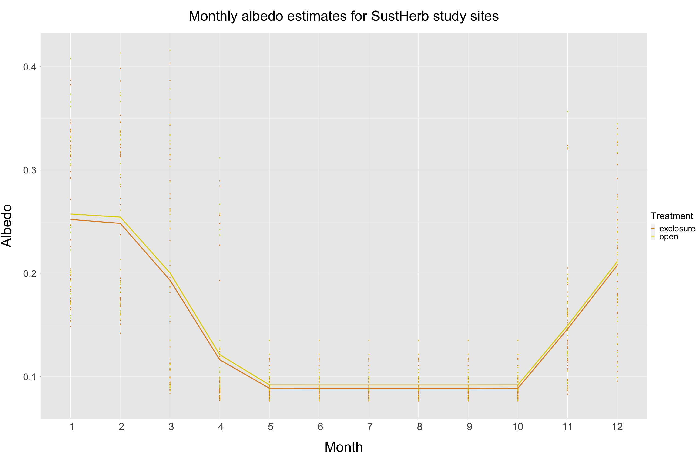
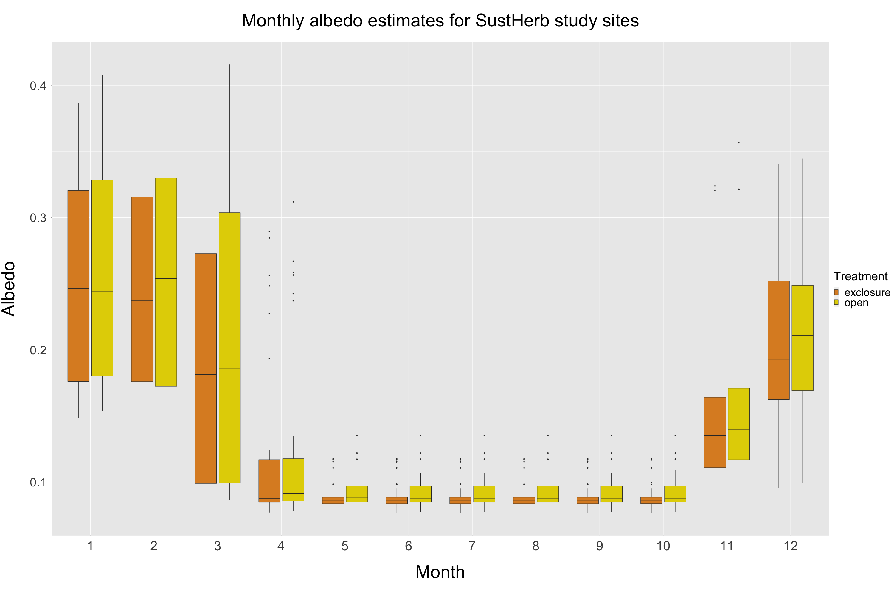
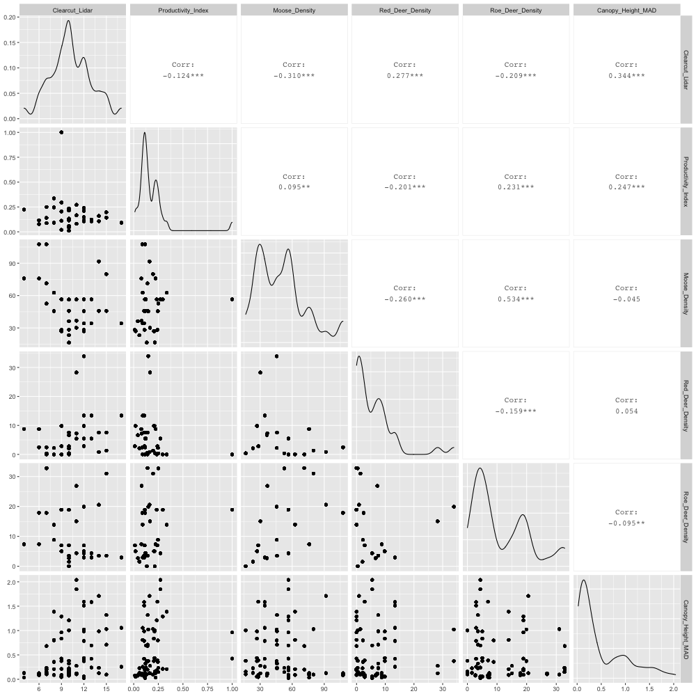
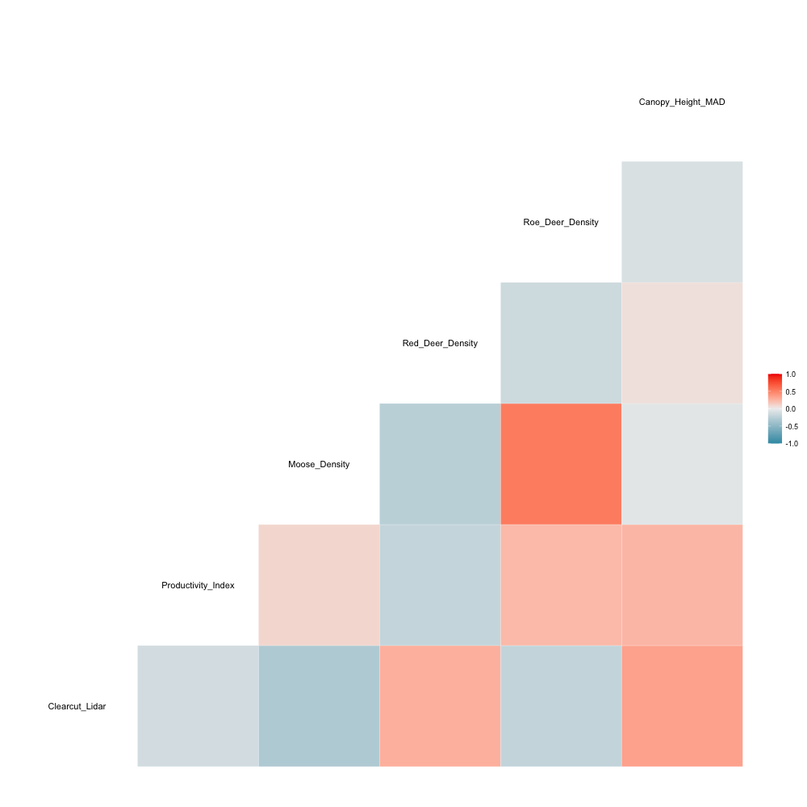
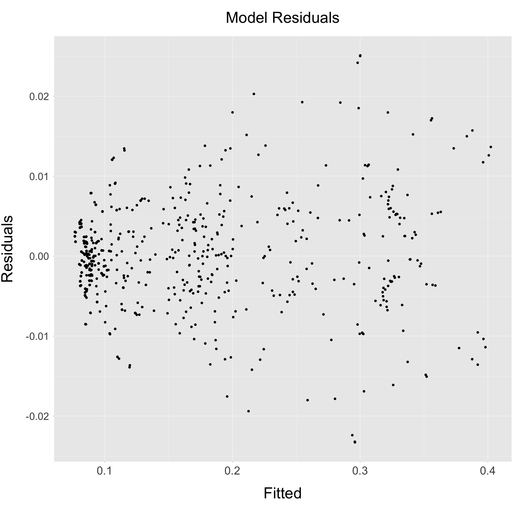
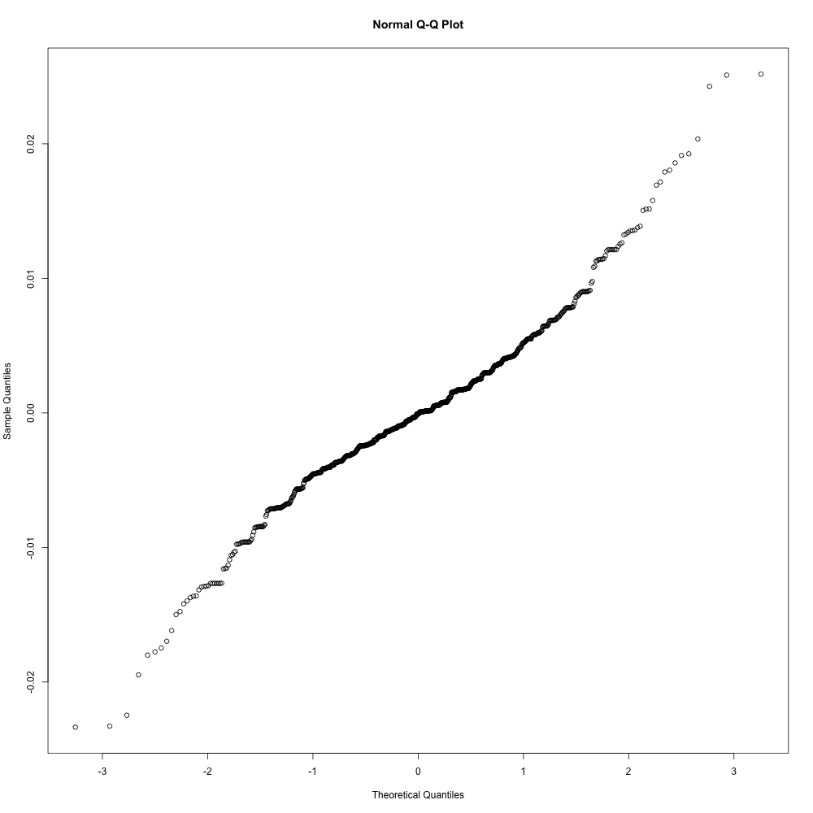
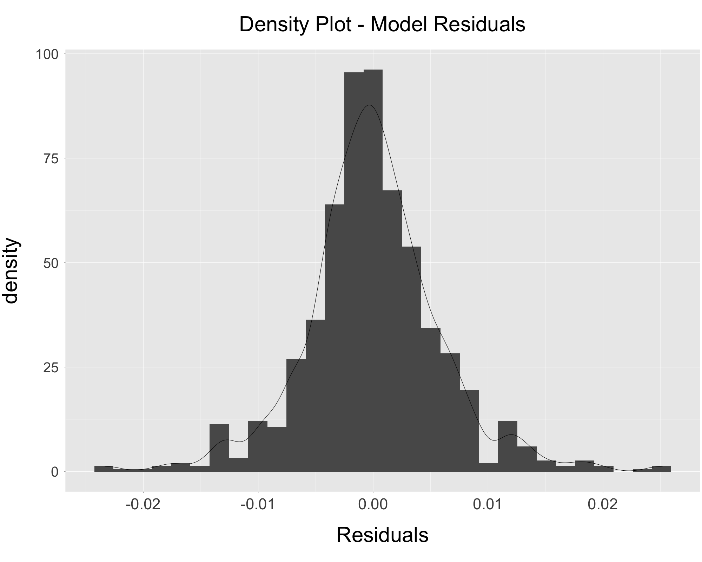
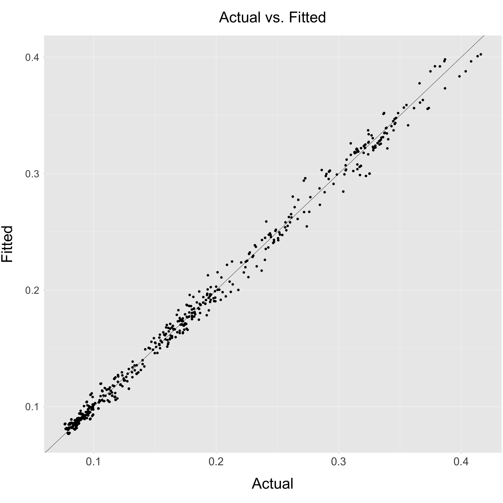

---
output:
  html_document: default
  word_document: default
  pdf_document: default
---

# Albedo Estimates - Approach 3
## ("LiDAR CHM" Approach)

**Summary:**
This document contains a summary of albedo estimates produced through 'Approach 3', including the figures listed below:

* *Section 1*. Plots relevant to final albedo estimates.
* *Section 2*. Mixed effects model.
* *Section 3*. Detailed summary of each SustHerb site.

  
***

## Section 1
This figure shows several plots related to the final albedo estimates produced by Approach 3. 
  
```{r pressure, echo=FALSE, out.width = '80%', fig.align="center"}




```

```{r, echo=FALSE, out.width = '100%', fig.align="center"}




```

***

\pagebreak

## Section 2
This figure shows an initial attempt at a mixed effects model analysis.

**Correlation matrix of explanatory variables**:
It looks like 'Moose Density' and 'Roe Deer Density' are moderately correlated (~0.51).

```{r, echo=FALSE, out.width = '80%', fig.align="center"}




```


**Model in R**: 
Random effect is month nested under site ("LocalityName")

```{r, echo=TRUE, eval=FALSE}
model <- lmer(Composite_Albedo ~ Treatment +
                      Productivity_Index +
                      Clearcut_Lidar +
                      Moose_Density +
                      Red_Deer_Density +
                      Roe_Deer_Density +
                      (1 | LocalityName/Month),
              data = model_data)
```

**Model Output**:

```{r, eval = TRUE, echo=FALSE, message=FALSE, out.width = '80%', fig.align="center"}

library(lme4)
library(lmerTest)
library(sjPlot)

#Get CSV of albedo estimates
model_data <- read.csv('../../../Approach_3/Output/Albedo_Estimates/albedo_estimates_approach_3.csv', header = TRUE)
                
#Format columns
model_data$Month <- as.factor(model_data$Month)
model_data$LocalityCode <- as.factor(model_data$LocalityCode)
model_data$LocalityName <- as.factor(model_data$LocalityName)
                
model <- lmer(Composite_Albedo ~ Treatment + Productivity_Index + Clearcut_Lidar + Moose_Density + Red_Deer_Density + Roe_Deer_Density + (1 | LocalityName/Month), data = model_data)

tab_model(model, digits = 5, file = "../../../Approach_3/Output/Analysis/model_approach_3.html")

```

**Exploring Model Fit**:

```{r, echo=FALSE, out.width = '80%', fig.align="center"}







```