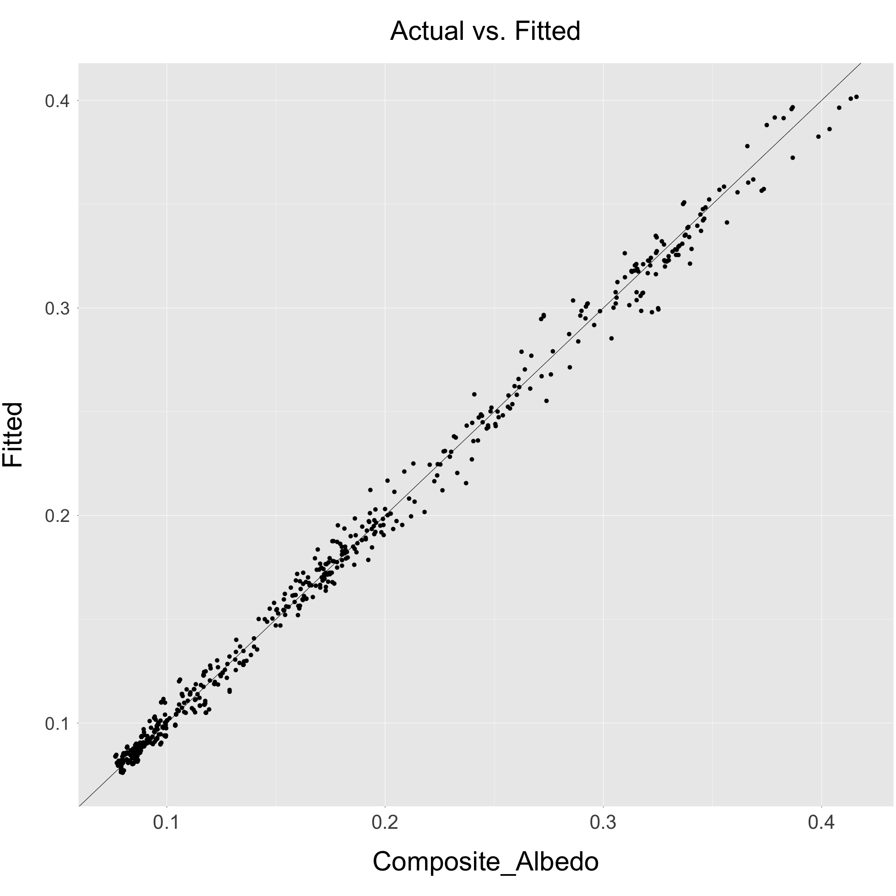
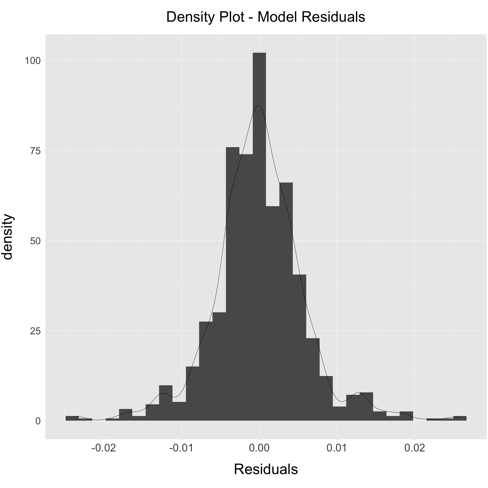
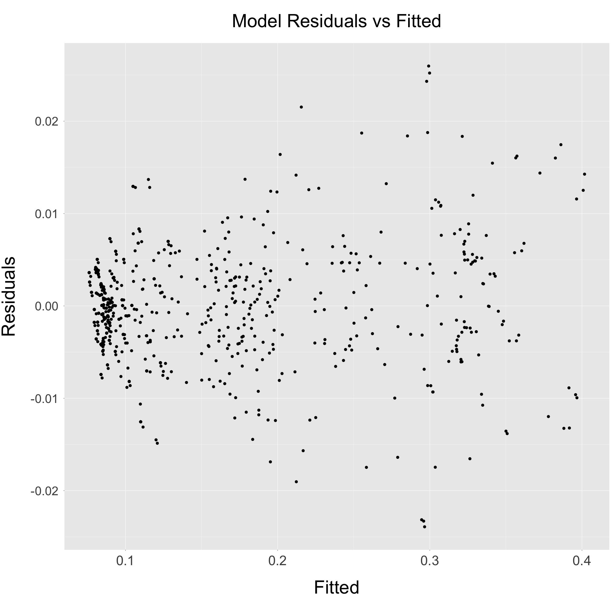

---
output:
  html_document: default
  word_document: default
  pdf_document: default
---

# Model - Approach 3
## ("LiDAR CHM" Approach)

**Summary:**
This document contains a summary of the mixed-effects model that best fit the data for this approach (which was chosen through a model selection process and identified as the model with the lowest AIC value):

* *Section 1*. Model form + output.
* *Section 2*. Exploration of model fit.

***

## Section 1
This figure shows the form of the best-fitting model, as well as a table with model output. For the random effect term in the model, 'LocalityName' is nested within 'Month'
  
```{r pressure, echo=TRUE, eval=FALSE}
model <- lmer(Composite_Albedo ~
                    Treatment + 
                    Productivity_Index +
                    Clearcut_Lidar +
                    Moose_Density +
                    Treatment*Productivity_Index +
                    (1 | Month/LocalityName),
            data = model_data)

```

**Model Output**:

```{r, eval = TRUE, echo=FALSE, message=FALSE, out.width = '80%', fig.align="center"}

library(lme4)
library(lmerTest)
library(sjPlot)

#Get CSV of albedo estimates
model_data <- read.csv('../../../Approach_3/Output/Albedo_Estimates/albedo_estimates_approach_3.csv', header = TRUE)
                
#Format columns
model_data$Month <- as.factor(model_data$Month)
model_data$Treatment <- as.factor(model_data$Treatment)
model_data$LocalityCode <- as.factor(model_data$LocalityCode)
model_data$LocalityName <- as.factor(model_data$LocalityName)

#Relevel factors to use 'browsed' as the control/reference
model_data$Treatment <- relevel(model_data$Treatment, ref = "open")
levels(model_data$Treatment)
                
model <- lmer(Composite_Albedo ~
                    Treatment + 
                    Productivity_Index +
                    Clearcut_Lidar +
                    Moose_Density +
                    Treatment*Productivity_Index +
                    (1 | Month/LocalityName),
            data = model_data)

tab_model(model, digits = 5, file = "../../../Approach_3/Output/Model_Selection/model_approach_3.html")

```


***

\pagebreak

## Section 2
This figure shows some plots related to model fit.

```{r, echo=FALSE, out.width = '70%', fig.align="center"}






```

***
