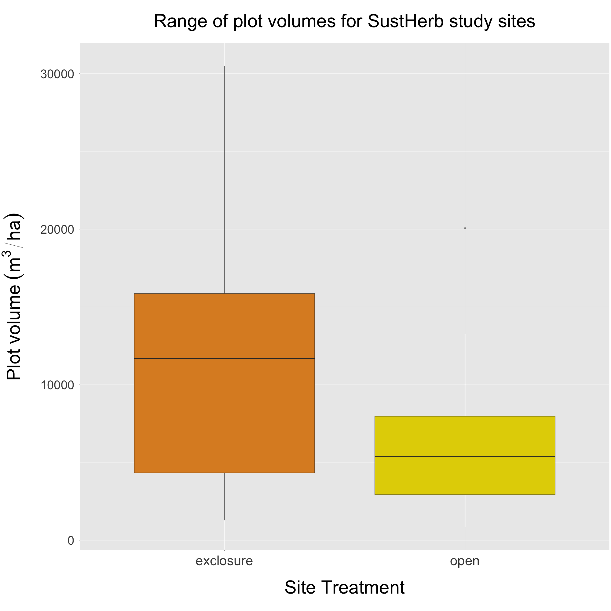
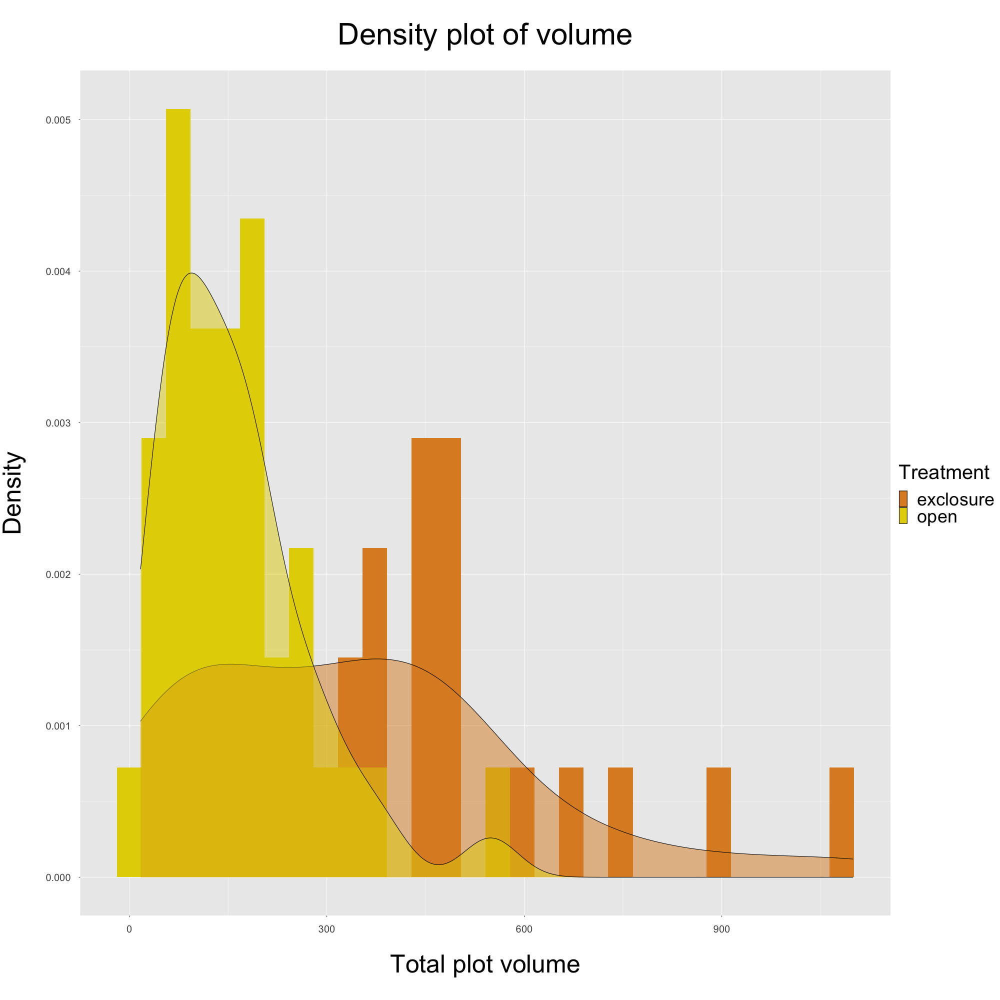
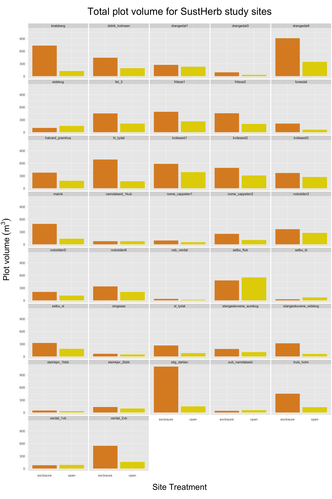

---
output:
  html_document: default
  word_document: default
  pdf_document: default
---
# Plot Tree Volumes - Approach 3
## ("LiDAR CHM" Approach)

**Summary:**
This document contains plots produced through 'Approach 3', specifically in regards to the total tree volume for each SustHerb study site plot. More specifically, it contains:

* *Figure 1*. Boxplot showing the range of total plot volumes for SustHerb study sites, grouped by treatment.
* *Figure 2*. Density plot showing distributions of plot volumes, grouped by treatment.
* *Figure 3*. Barplot showing total plot volumes for SustHerb study sites, faceted by site and grouped by treatment.
* *Figure 4*. Canopy height models (CHM) for each plot, clipped to 20x20m with trees >7m in height removed.  
  
***

**Figure 1:**
This figure shows the range of total plot volumes for SustHerb study sites, grouped by treatment. Using Approach 3, it appears that exclosures are estimated to have a higher total volume than open plots.
  
  
```{r pressure, echo=FALSE, out.width = '70%', fig.align="center"}

```


***
\pagebreak

**Figure 2:**
This figure shows distributions of volumes grouped by treatment.
  
```{r echo=FALSE, out.width = '85%', fig.align="center"}

```

***

\pagebreak

**Figure 3:**
This figure shows plot volumes for each SustHerb study site, grouped by treatment.
  
```{r echo=FALSE, out.width = '85%', fig.align="center"}

```
\pagebreak

It appears that there are a few sites where the estimated plot volume for exclosures is substantially higher than in corresponding open plots:

* Bratsberg
* Hi_tydal
* Drangedal4
* Stig Dahlen

Additionally, the 'Selbu_flub' site has higher estimated volume in its open plot than in its exclosure. The CHMs for these sites (as well as all other SustHerb sites) can be found in the next figure.

***

**Figure 4:**
This figure shows both the initial CHMs (unclipped, big trees present) and final CHMs (clipped, big trees removed) for each SustHerb plot used in this approach. Initial CHMs were created immediately after topographical normalization of the original LAS file, while final CHMs were created after removal of LiDAR points associated with big trees (>7m tall) and clipping to 20x20m.

To generate the CHMs, I used a slightly different approach than Ingrid Snøan did in her project - she used the 'p2r' digital surface model algorithm, while I used the 'pitfree' algorithm and a few other parameters that were recommended by Khosravipour et al. (2014) to minimize the number of pits in the CHM while maximizing resolution. I tested various pixel resolutions for the CHM models, and found that a resolution of 0.5m seemed to produce the most detailed CHM with the fewest pits.

For the sites that had a substantial difference in total volume, here's what the CHMs reveal:

* Bratsberg: the exclosure does seem to have a much denser and higher canopy than the open plot, which would suggest that volume would be higher. This one looks OK in my opinion.
* Hi_tydal: same as Bratsberg - the exclosure just seems to have a denser and higher canopy than the open plot - looks OK.
* Drangedal4: same as the above sites.
* Stig Dahlen: same as the above sites.


```{r echo=FALSE, fig.show = "hold", out.width = '40%', fig.align="center"}

files <- list.files(path = '../../../Approach_3/Output/Tree_Volumes/CHM/',
                    full.names = TRUE)

knitr::include_graphics(files)

```
