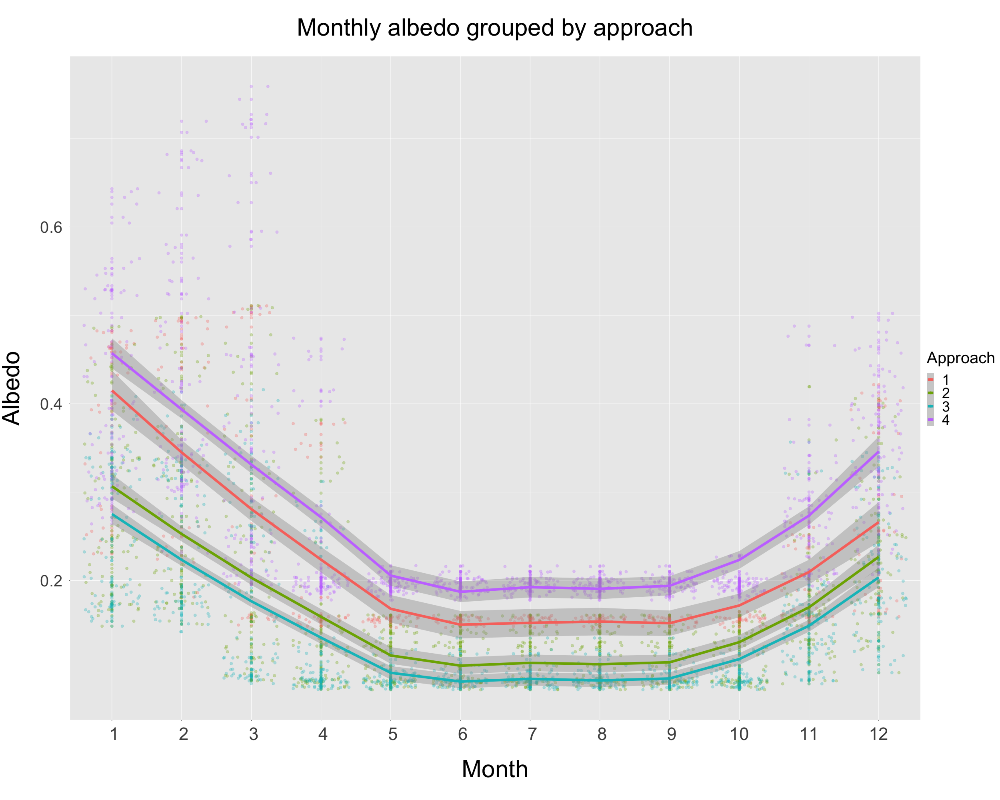
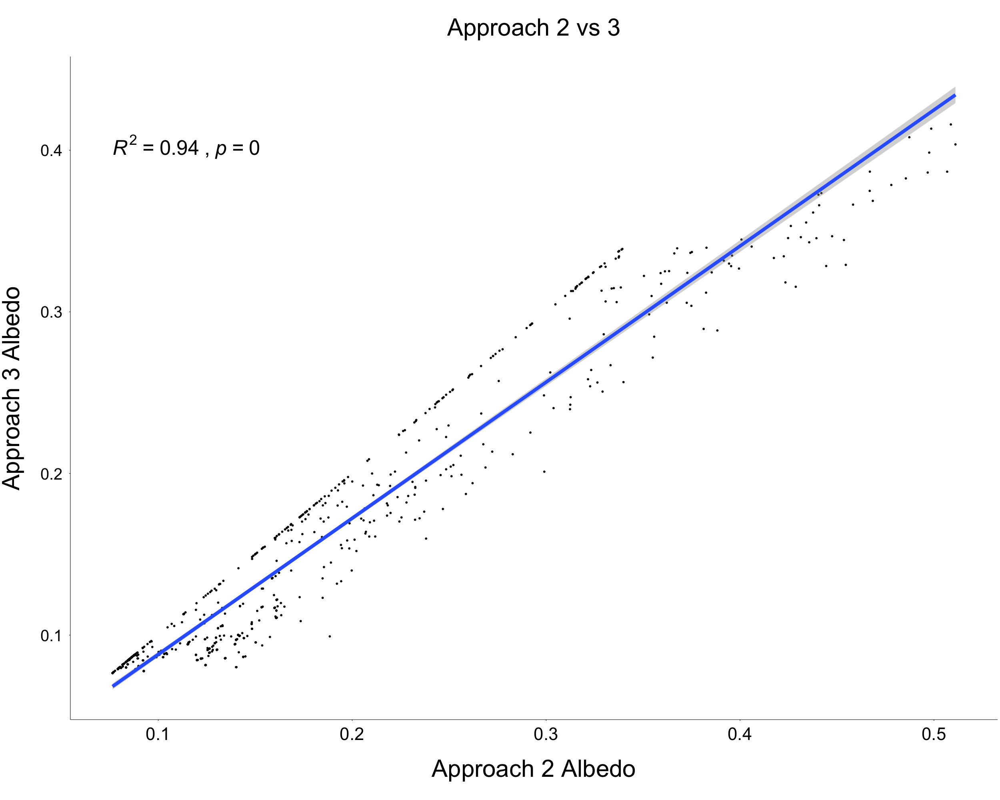
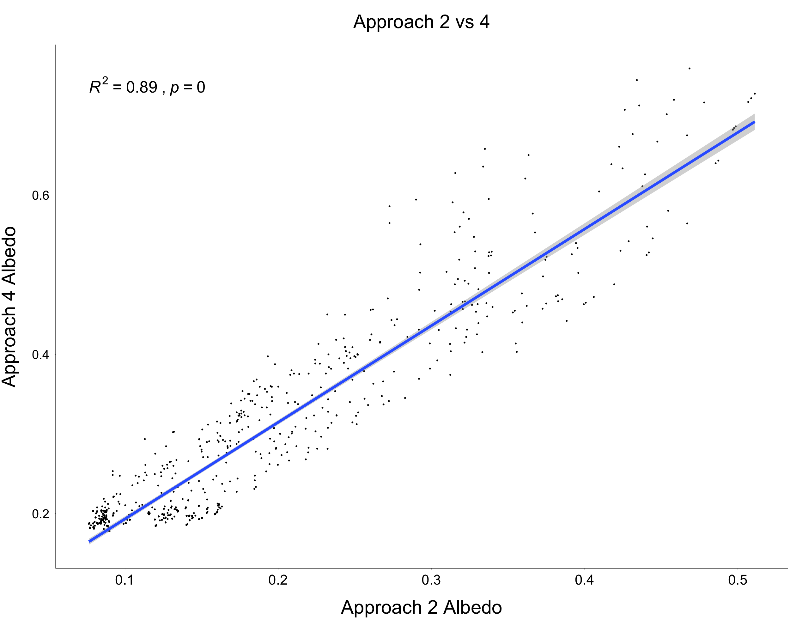
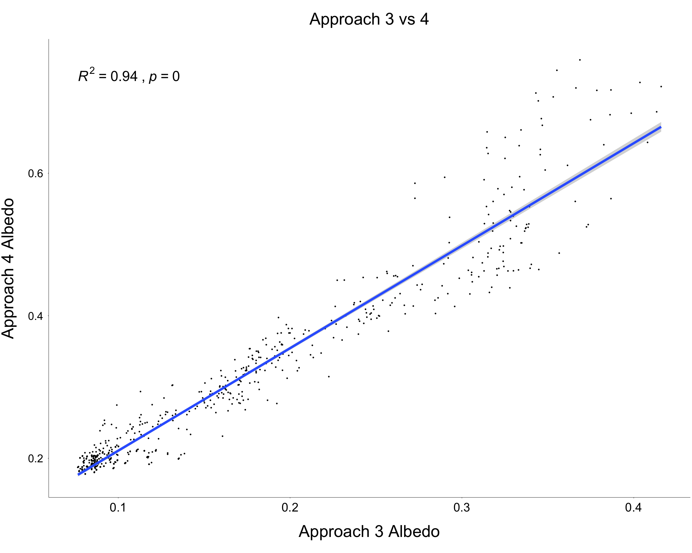

---
output:
  html_document: default
  word_document: default
  pdf_document: default
---

# Comparison of Approaches
## (Albedo Estimates)

**Summary:**
This document contains some basic plots that allow for initial comparison of the four different methods used to estimate monthly albedo at SustHerb study sites:

* *Section 1*. Rough comparison of albedo estimates produced by each approach.
* *Section 2*. Comparisons of Approaches 2-4.

***

## Section 1
The figure below provides a rough look at the albedo estimates produced by each approach. Each line represents the monthly mean albedo for a given approach. Note that Approach 1 only uses data from the Trøndelag region.
  
```{r pressure, echo=FALSE, out.width = '80%', fig.align="center"}



```

***

\pagebreak

## Section 2
This section contains scatterplots with all albedo estimates produced by each approach. Approach 1 is not included in this comparison, as it uses data from 2016 and only from Trøndelag, which means that it's not directly comparable (in terms of time since clearcut) with the other approaches.

```{r, echo=FALSE, out.width = '80%', fig.align="center"}





```

***
